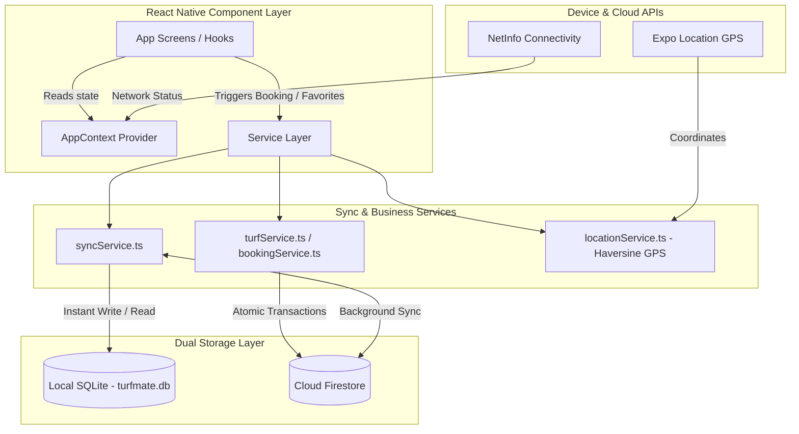

# TurfMate — Sports Venue & Turf Booking Mobile Application

[](https://expo.dev)
[](https://reactnative.dev)
[](https://www.typescriptlang.org)
[](https://firebase.google.com)
[](https://docs.expo.dev/versions/v54.0.0/sdk/sqlite)
[](https://expo.dev/eas)

**TurfMate** is a production-grade, cross-platform mobile application for discovering sports venues, checking real-time time-slot availability, and making instant turf reservations. Built with **React Native**, **Expo SDK 54**, **TypeScript**, **Firebase Cloud Firestore**, and **embedded SQLite**, TurfMate features a hybrid **dual-database sync architecture** that guarantees instant sub-millisecond local responses, full offline resilience, atomic double-booking protection, and interactive Google Maps integration.

---

## 🌟 Key Features Overview

| Feature Category | Capability Highlights |
| :--- | :--- |
| **Authentication & Profile** | Firebase Email/Password auth, session persistence via `@react-native-async-storage/async-storage`, guest access mode, and Firestore user profile synchronization. |
| **Hybrid Dual-Sync Storage** | Local-first architecture powered by `expo-sqlite` and `syncService.ts` for instant offline queries, backed by real-time Cloud Firestore cloud syncing. |
| **Venue Discovery & Filtering** | Multi-sport filtering (Football, Cricket, Badminton, Tennis, Basketball), name/location search, and real-time Haversine distance proximity badges. |
| **Interactive Map Experience** | Native `react-native-maps` integration with custom markers, scale-animated selection, floating preview cards, and deep-linking between details and map views. |
| **14-Day Atomic Slot Booking** | Real-time morning/evening slot availability checks with Firestore transaction locks (`runTransaction`) ensuring zero race conditions or double-bookings. |
| **Booking & Reservation Suite** | Instant entry QR code generation (`BKG-...`), promotional coupon code validation, status filters (Upcoming, Completed, Cancelled), and slot release logic. |
| **Network & Offline Resilience** | Real-time network detection via `@react-native-community/netinfo` (`useNetworkStatus`) with notch-aware `OfflineBanner` alerts. |
| **Dark & Light Mode** | Native system theme detection and manual light/dark theme toggle via `AppContext`. |
| **EAS Build Ready** | Configured `eas.json` profiles for preview APK generation and production App Bundle (`.aab`) compilation. |

---

## 🏗️ Architecture & Data Synchronization Pipeline

TurfMate employs a **Local-First, Cloud-Synced Data Architecture**. When the app launches, data is fetched immediately from local SQLite for instant UI rendering, while background workers synchronize updates with Cloud Firestore.



### Double-Booking Prevention Logic
Slot concurrency is guaranteed using **Cloud Firestore Atomic Transactions**. Each slot creates a deterministic lock key in the `timeSlots` collection formatted as:
```text
lockKey = ${venueId}_${date}_${startTime}
```
If two users attempt to book the exact same slot concurrently (even within milliseconds), Firestore rejects the second transaction atomically, preventing double-bookings.

---

## 🛠️ Technology Stack Matrix

The exact dependencies configured in `package.json`:

| Package / Tool | Version | Purpose |
| :--- | :--- | :--- |
| **Expo Framework** | `~54.0.35` | Universal React Native development runtime |
| **React Native** | `0.81.5` | Native mobile component primitives |
| **React** | `19.1.0` | UI rendering engine & state hooks |
| **TypeScript** | `~5.9.2` | Static type checking and intellisense |
| **Firebase SDK** | `^12.17.1` | Auth & Cloud Firestore real-time backend |
| **Expo SQLite** | `~15.1.4` | Local embedded SQLite database (`turfmate.db`) |
| **Expo Router** | `~6.0.24` | File-based typed routing framework |
| **React Native Maps** | `1.20.1` | Native Google Maps interactive map integration |
| **Async Storage** | `2.2.0` | Session key-value store for Auth persistence |
| **NetInfo** | `11.4.1` | Real-time network interface listener |
| **Expo Location** | `~19.0.8` | Device GPS coordinate acquisition |
| **Reanimated** | `~4.1.1` | Native UI animations (`react-native-reanimated`) |
| **EAS CLI** | `>= 3.0.0` | Expo Application Services build configuration |

---

## 📁 Directory & Navigation Structure

```text
TurfMate/
├── app/                        # Expo Router Pages & Navigation
│   ├── _layout.tsx             # Root layout, Auth guard, Theme & SQLite Provider
│   ├── index.tsx               # Splash screen & onboarding redirect
│   ├── onboarding.tsx          # Interactive user onboarding flow
│   ├── search.tsx              # Live venue search and filter page
│   ├── map.tsx                 # Interactive full-screen Google Map view
│   ├── settings.tsx            # Application settings & theme switcher
│   ├── support.tsx             # Help center & FAQ screen
│   ├── terms.tsx               # Terms & conditions document
│   ├── privacy.tsx             # Privacy policy document
│   ├── about.tsx               # About TurfMate app info
│   ├── (auth)/                 # Unauthenticated Auth Stack
│   │   ├── login.tsx           # Email/Password sign-in screen
│   │   └── register.tsx        # User registration screen
│   ├── (tabs)/                 # Authenticated Tab Bar Stack
│   │   ├── index.tsx           # Home dashboard with live venue feed & GPS distance
│   │   ├── explore.tsx         # Sports category & turf exploration
│   │   ├── bookings.tsx        # My Bookings dashboard (Upcoming / Completed / Cancelled)
│   │   ├── wishlist.tsx        # Saved favorite turfs screen
│   │   ├── ai.tsx              # AI Turf Assistant chat interface
│   │   └── profile.tsx         # User profile, reward points & account settings
│   ├── venue/
│   │   └── [id].tsx            # Dynamic venue details & map deep link
│   └── booking/                # Multi-step Booking Flow
│       ├── date.tsx            # 14-day calendar date picker
│       ├── slot.tsx            # Real-time morning/evening slot availability picker
│       ├── summary.tsx         # Pricing breakdown, coupon application & checkout
│       ├── success.tsx         # Booking confirmation & entry QR code
│       └── detail.tsx          # Standalone reservation details view
├── components/                 # Reusable UI Component Library
│   ├── OfflineBanner.tsx       # Safe-area aware offline alert banner
│   └── UI/                     # Buttons, cards, badges, and input elements
├── database/                   # SQLite Storage Layer
│   ├── localDatabase.ts        # SQLite initialization, table schemas & CRUD
│   ├── sampleData.ts           # Initial venue seed datasets
│   └── schema.ts               # Local database TypeScript interfaces
├── services/                   # Business Logic & External Integrations
│   ├── syncService.ts          # Dual SQLite/Firestore data synchronizer
│   ├── authService.ts          # Firebase Auth logic & persistence handlers
│   ├── bookingService.ts       # Firestore atomic transaction booking engine
│   ├── turfService.ts          # Venue query & seeding service
│   ├── locationService.ts      # GPS location retrieval & Haversine distance calculator
│   └── firebase.ts             # Firebase app & Firestore initialization
├── store/                      # Application Context
│   └── AppContext.tsx          # Global state (User, Theme, Bookings, Favorites)
├── firestore.rules             # Cloud Firestore Security Rules
├── eas.json                    # Expo Application Services build configuration
├── app.json                    # Expo project configuration & plugins
└── package.json                # Project dependencies & scripts
```

---

## 🗄️ Database Architecture & Schemas

### 1. Cloud Firestore Collections

```text
User (`users`) ──► creates ──► Booking (`bookings`) ──► for ──► Venue (`venues`)
                                    │
                                    ▼
                    Time Slot Lock (`timeSlots`)
```

- **`users`**: `{ id, name, email, phone, isVerified, rewardPoints, createdAt }`
- **`venues`**: `{ id, name, type, sports, rating, reviews, pricePerHour, location, image, gallery, facilities, latitude, longitude }`
- **`bookings`**: `{ id, userId, venueId, date, timeSlot, amount, status, createdAt }`
- **`timeSlots`**: `{ id: "${venueId}_${date}_${startTime}", venueId, date, startTime, isBooked, bookedBy }`

### 2. Local SQLite Tables (`turfmate.db`)

Initialised in WAL (Write-Ahead Logging) mode via `database/localDatabase.ts`:

```sql
CREATE TABLE IF NOT EXISTS users (
  id TEXT PRIMARY KEY,
  name TEXT,
  email TEXT,
  phone TEXT,
  isVerified INTEGER,
  points INTEGER
);

CREATE TABLE IF NOT EXISTS venues (
  id TEXT PRIMARY KEY,
  name TEXT,
  type TEXT,
  sportsJson TEXT,
  rating REAL,
  reviews INTEGER,
  distance TEXT,
  pricePerHour REAL,
  location TEXT,
  image TEXT,
  galleryJson TEXT,
  facilitiesJson TEXT,
  openingHours TEXT,
  description TEXT,
  latitude REAL,
  longitude REAL
);

CREATE TABLE IF NOT EXISTS bookings (
  id TEXT PRIMARY KEY,
  userId TEXT,
  venueId TEXT,
  date TEXT,
  timeSlot TEXT,
  amount REAL,
  status TEXT
);

CREATE TABLE IF NOT EXISTS favorites (
  id TEXT PRIMARY KEY,
  userId TEXT,
  venueId TEXT
);
```

---

## 🚀 Getting Started & Local Installation

### Prerequisites

- **Node.js**: `v18.x` or `v20.x` recommended
- **Package Manager**: `npm` (comes with Node.js)
- **Expo Go App**: Installed on iOS/Android physical device, or Android Studio / Xcode Emulators.

### Installation Steps

1. **Clone the repository**:
   ```bash
   git clone https://github.com/Vishalj154/Turfmate.git
   cd TurfMate
   ```

2. **Install project dependencies**:
   ```bash
   npm install
   ```

3. **Verify TypeScript compilation**:
   ```bash
   npx tsc --noEmit
   ```

4. **Start the Expo development server**:
   ```bash
   npx expo start
   ```

5. **Run on Device / Emulator**:
   - Press **`a`** for Android Emulator.
   - Press **`i`** for iOS Simulator.
   - Scan the terminal QR code using **Expo Go** on a physical smartphone.

---

## 📱 EAS Build Configuration (`eas.json`)

TurfMate is configured for building standalone native binaries (`.apk` / `.aab`) via Expo Application Services (EAS):

```json
{
  "cli": {
    "version": ">= 3.0.0"
  },
  "build": {
    "development": {
      "developmentClient": true,
      "distribution": "internal"
    },
    "preview": {
      "android": {
        "buildType": "apk"
      },
      "distribution": "internal"
    },
    "production": {
      "android": {
        "buildType": "app-bundle"
      }
    }
  }
}
```

### Building Standalone Android APK

To trigger an automated cloud build for an Android testing APK:
```bash
npx eas build --platform android --profile preview
```

---

## 🔒 Cloud Firestore Security Rules (`firestore.rules`)

```javascript
rules_version = '2';
service cloud.firestore {
  match /databases/{database}/documents {
    match /users/{userId} {
      allow read, write: if request.auth != null && request.auth.uid == userId;
    }
    match /venues/{venueId} {
      allow read: if request.auth != null;
      allow write: if request.auth != null && request.auth.uid == resource.data.ownerId;
    }
    match /bookings/{bookingId} {
      allow read: if request.auth != null && resource.data.userId == request.auth.uid;
      allow create: if request.auth != null && request.resource.data.userId == request.auth.uid;
      allow update, delete: if request.auth != null && resource.data.userId == request.auth.uid;
    }
    match /timeSlots/{slotId} {
      allow read: if request.auth != null;
      allow create, update: if request.auth != null;
    }
  }
}
```

---

## ✅ Quality Assurance & Testing Checklist

- [x] **Strict Type-Checking**: Verified clean output with `npx tsc --noEmit`.
- [x] **Dual Database Sync**: Confirmed instant SQLite table initialization and background Firestore data population.
- [x] **Interactive Maps**: Validated Google Maps marker rendering, pop-up venue cards, and deep-link routing.
- [x] **GPS Distance**: Verified live Haversine distance calculations and nearest-first venue sorting.
- [x] **Atomic Transactions**: Confirmed concurrent booking conflict prevention via Firestore slot lock keys.
- [x] **Offline Resilience**: Simulated offline state with `NetInfo` alerts; validated local SQLite read/write fallback.

---

## 📄 Version & License

- **Version**: `1.0.0` (as defined in `package.json` and `app.json`)
- **License**: MIT License — open for academic, portfolio, and development demonstration purposes.
